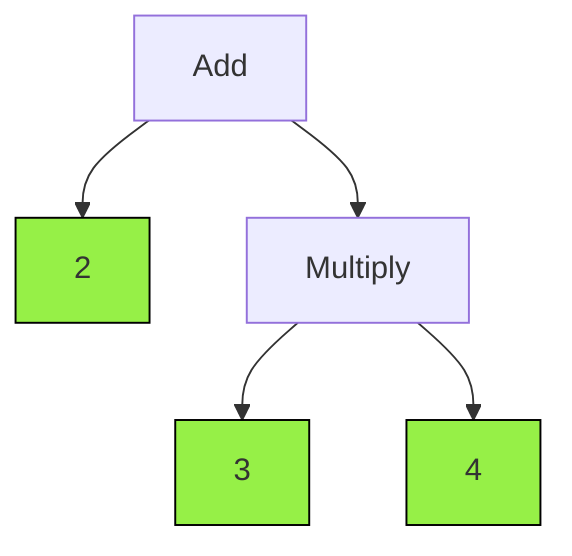
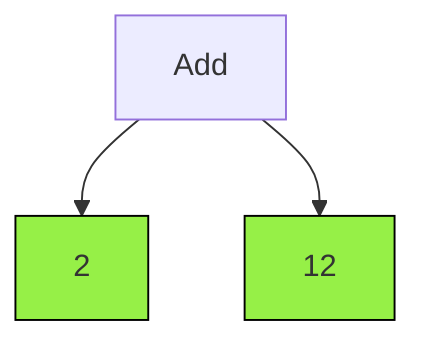

# MathNode

MathNode is the base class for every node & leafs in the binary tree.
It provides the following definitions for node & leafs

## Properties

### type: [MathNodeType](./mathNodeType)
The type of the current node.

```ts
import { parse } from '@math-x-ts/parse';
import { MathNodeType } from '@math-x-ts/core';

const mathNode1 = parse('1 + 2');
const mathNode2 = parse('2 - 1');
const mathNode3 = parse('3 * 4');
const mathNode4 = parse('6 : 3');
const mathNode5 = parse('8 / 4');
const mathNode6 = parse('2 ^ 3');

console.log(mathNode1.type === MathNodeType.Add);      // true
console.log(mathNode2.type === MathNodeType.Subtract); // true
console.log(mathNode3.type === MathNodeType.Multiply); // true
console.log(mathNode4.type === MathNodeType.Divide);   // true
console.log(mathNode5.type === MathNodeType.Fraction); // true
console.log(mathNode6.type === MathNodeType.Exponent); // true

```

### value: number
The value of the current node as a number

### isAtomic: boolean

Tell if the current node is atomic. An atomic node is a node that can't be split, can't be simplified.
An example of an atomic node is a constant, and an example of a non-atomic node is the expression "1 + 2".
If you visualize it as a binary tree, atomic nodes are actually the leafs of the tree.


``` typescript
import { parse } from '@math-x-ts/parser';
import { Constant } from '@math-x-ts/core';

const mathNode1 = parse('1');
const mathNode2 = new Constant(1);
console.log(mathNode1.isAtomic) // true;
console.log(mathNode2.isAtomic) // true;

const mathNode3 = parse('2 + 3 * 4');
console.log(mathNode1.isAtomic); // false 
```

## Functions

### next: () => MathNode

The next function try to simplify the current node and return the next step as a MathNode.
If the node is atomic then it just returns the same instance.
When trying to simplify a node, it always starts with the deepest node in the tree.

Let's take a look at the expression **2 * (3 + 4)** <br/>

```ts
import { parse } from '@math-x-ts/parser';

const step0 = parse('2 + 3 * 4');
console.log(step0.isAtomic) // false;
console.log(step0.toString()) // '2 + 3 * 4')
```

The binary tree for **step0** looks like this:



The green color indicates which node is atomic. As you can see in the diagram only leafs are atomic and each leaf is a constant. <br/> 
By calling the **.next()** function on the above expression it should simplify its deepest node and return a new MathNode.
In this example the deepest node is **3 * 4**.

```ts
const step1 = step0.next();
console.log(step1.isAtomic); // false
console.log(step1.toString()); // '2 + 12'
```

The new binary tree for step1 look like this



If we call the **.next()** function once more, the node will be atomic

```ts
const step2 = step1.next();
console.log(step2.isAtomic); // true
console.log(step2.toString()); // '14'
```