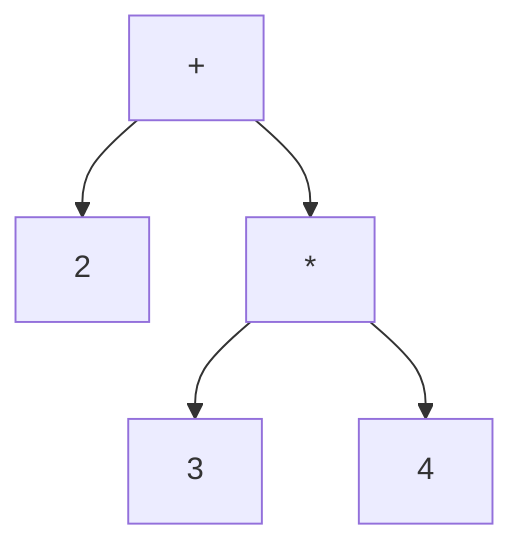

# Concept

This project is a monorepo containing 2 main packages in order to solve mathematical expression
and get step by step solution.

- **@math-x-ts/core**
- **@math-x-ts/parser**

The goal of this section is to cover the features of those packages. 

## Syntax tree

To easily manipulate mathematical expression, the expressions must be organized in a certain way.
Just like a compiler which read a program written in a formal language and build an [AST](https://en.wikipedia.org/wiki/Abstract_syntax_tree),
this library is capable of reading mathematical expression and transform them in a pre-defined data structure.

A mathematical expression can be represented as a binary tree.
For example **2 + 3 * 4** can be written as:



## @math-x-ts/core

This package provides the pieces of code necessary to build a binary tree for a math expression. <br/>
Nodes & leafs are nothing more than typescript Classes with their own properties and logic.

Here is an example in the code of the above binary tree:

```ts

import { Add, Contant, Multiply } from '@math-x-ts/core';

const mathNode = new Add(
    new Constant(2),
    new Multiply(
        new Constant(3),
        new Constant(4),
    )
);
```

## @math-x-ts/parser

Imagine now having a much longer expression like **3 * (4 + 5 + (10 - 6))**.
Creating a binary tree by yourself for this kind of expression can be annoying.
This is where the parser comes in. It read a mathematical expression and provide code generation for building binary tree
using **@math-x-ts/core**

Here is an example in the code.

```ts
import { parse } from '@math-x-ts/parser'

const mathNode1 = parse('2 + 3 * 4');

const mathNode2 = new Add(
    new Constant(2),
    new Multiply(
        new Constant(3),
        new Constant(4),
    )
);

console.log(mathNode1.isEqual(mathNode2)) // true
```
