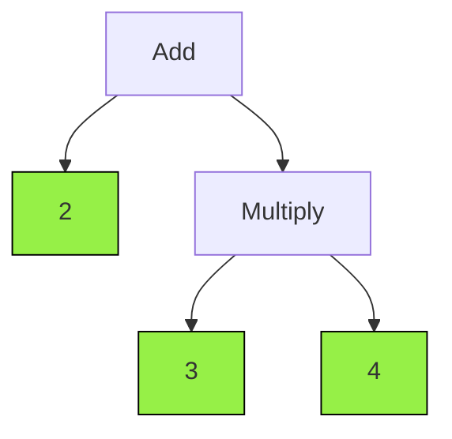
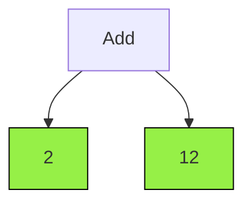

# Step by step solution

Let's get a step by step solution for the expression **2 * (3 + 4)** <br/>

## Using .next()

```ts
import { parse } from '@math-x-ts/parser';

const step0 = parse('2 + 3 * 4');
console.log(step0.isAtomic) // false;
console.log(step0.toString()) // '2 + 3 * 4')
```

The binary tree for **step0** looks like this:



The green color indicates which node is atomic. As you can see in the diagram only leafs are atomic and each leaf is a constant. <br/>
By calling the **.next()** function on the above expression it should simplify its deepest node and return a new MathNode.
In this example the deepest node is **3 * 4**.

```ts
const step1 = step0.next();
console.log(step1.isAtomic); // false
console.log(step1.toString()); // '2 + 12'
```

The new binary tree for step1 look like this



If we call the **.next()** function once more, the node will be atomic

```ts
const step2 = step1.next();
console.log(step2.isAtomic); // true
console.log(step2.toString()); // '14'
```

## Using .solveAll()

Instead of calling .next() function N times until the hole node is atomic,
you can call .solveAll() which return an array with all the steps. 

```ts
import { parse } from '@math-x-ts/parser';

const steps = parse('2 + 3 * 4').solveAll();

steps.forEach((mathNode) => {
    console.log(mathNode.toString());
});

// log: 2 + 3 * 4
// log: 2 + 12
// log: 14
```
